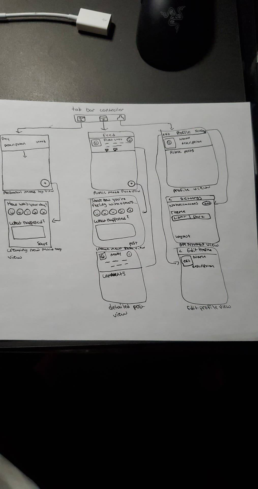

Original App Design Project - README Template
===

# TrackYourMood 

## Table of Contents
1. [Overview](#Overview)
1. [Product Spec](#Product-Spec)
1. [Wireframes](#Wireframes)
2. [Schema](#Schema)

## Overview
### Description
Mood tracking app that reminds users daily (either at a default time or at a time of their choosing) to reflect on their day. App will also have social networking features allowing users to post about their days.

### App Evaluation
[Evaluation of your app across the following attributes]
- **Category:** Health & Fitness / Social
- **Mobile:** Mobile first experience 
- **Story:** Allows users to post about their feelings as well as keep a log about their general mood for each day of the week.
- **Market:** Anyone who wants to track their moods in order to understand their mental better
- **Habit:** Nudges users to use the app daily through notifications reminding them to write about their day.
- **Scope:** A calendar view with the option to click on each day so that the user can write down their thoughts. A feed where users can share their thoughts for today.

## Product Spec

### 1. User Stories (Required and Optional)

**Required Must-have Stories**

* User will be able sign in to ther existing account or register for a new one
* User will be able to write down their mood / feelings, organized by date.
* User will be able to edit their writings or mood even after they submit it
* User can post a text update about their day to other users on the site.
* User will be able to sign in/ sign up through different authentication sources (Google, Facebook)
* Give the user the ability to change default settings on the app

**Optional Nice-to-have Stories**

* User has the ability to make their post anonymous 
* User can have a local account (Doesn't save their posts to the database)
* User can delete their posts
* User can configure their profile

### 2. Screen Archetypes

* Login / Sign Up Page
   * The user will be able to sign in / sign up
* Mood Page
   * User will be able to log their feelings, thoughts, moods on this screen.
   * User will have the option to view their past logs 
   * User will be able to edit their past logs
* Settings Page
    * User will have the option to change a few settings (notification time, theme, etc)
* Feed Page
    * User will be able to view other's posting their status updates
    * User will be able to post their own status update
### 3. Navigation

**Tab Navigation** (Tab to Screen)

* Mood Tab
* Feed Tab
* Profile Tab

**Flow Navigation** (Screen to Screen)

* Login / Sign Up 
   * Mood Page
* Mood Page
   * Settings Page
   * Update your log
* Feed Page
    * Create a Post
* Profile Page 
    * Update profile page

## Wireframes
[Add picture of your hand sketched wireframes in this section]

### [BONUS] Digital Wireframes & Mockups

### [BONUS] Interactive Prototype

## Schema 
### Models
**User**
| Property | Type | Description |
| -------- | ---- | ----------- |
| email | NSString | Email that the user used in order to sign up |
| name | NSString | Display name for the user (visible in profile and feed) |
| age | NSNumber | User age for profile display purposes |

### Networking
- [Add list of network requests by screen ]
- [Create basic snippets for each Parse network request]
- [OPTIONAL: List endpoints if using existing API such as Yelp]
